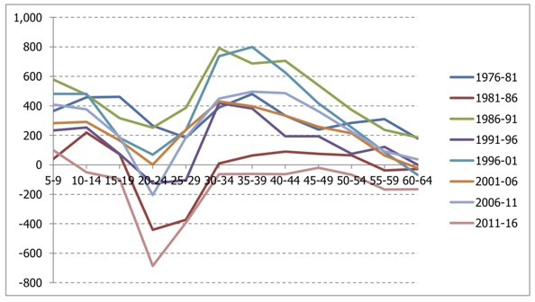
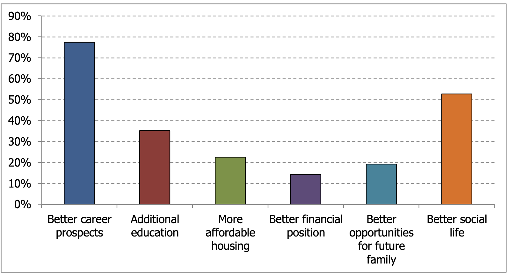
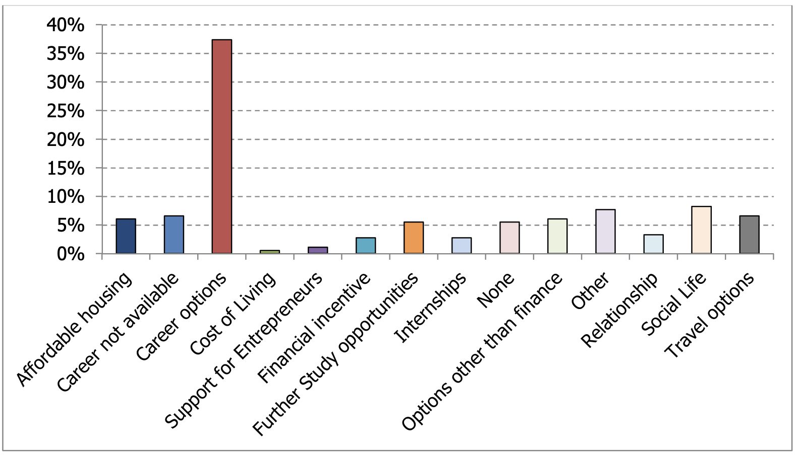

# Population Projections for the Isle of Man (2021 to 2051) and their application to the Area Plan for the North and West

The Isle of Man Strategic Plan is the Isle of Man's overarching planning policy framework. The document has a lifetime of 2011 to 2026. The Area Plan for the North and West prepared by Cabinet Office must be made in general conformity with this plan, and not the Government's Island Plan or Economic Strategy.

The Area Plan for the North and West proposes residential land allocation for between 965 and 2,260 housing units, depending on which method is used to calulate expected yield (number of housing units actually expected to be built). Despite this, the latest evidence strongly suggests that little to no land allocation is actually required in the Area Plan. Specifically, the Area Plan for the North and West fails to fully incorporate the latest 2021 census data, evidence on the drivers of migration patterns, and makes many questionable assumptions that act together to inflate the amount of residential land allocation (i.e. greenfield development) required by many orders of magnitude. Below, I demonstrate the inadequacy of the assumptions used by Cabinet Office.

## Enough housing has already been constructed to meet the community's needs to 2026

Despite thousands of housing units being constructed between 2011 and 2021, the size of the population was identical to 2011 levels by 2021. With little change in vacancy rates, this manifests in the census data as a sharp decline in mean household size. 

<!-- Although the decline in mean household size may arise from pent-up demand, changes in the distribution of household size by property type 2011 - 2021 suggest that the trend is being primarily driven by:

- (i) an increase in the number of 3+ room detached single-person households Island-wide;
- (ii) an increase in single-person flats in Douglas; and
- (iii) an Island-wide decline in the occupancy of medium and larger terraced housing. -->

In the Area Plan for the North and West, Cabinet Office have proposed to allocate enough land as residential to provide up to 1,784 developable housing units. Cabinet Office suggest that the estimated yield for these sites will be 965, once the probability of development, land use for community facilities and infrastructure, and 'net biodiversity gain' are taken into account.

However, there are four key failures within the method used to arrive at the 965 figure:

1. The figure targets the Stratetic Plan's housing need figure without accounting explicitly for the latest 2021 census data.
2. Estimates of yield deviate from previous methods with no justification to cause lower per-site housing yields thus inflating the land required per housing unit.
3. The low yield estimates and failure to explicitly include the latest census data combine to artificially inflate the required land per housing unit.
4. The 'pro-rata' method used (that attempts to account for the speed at which development may occur) has no logical basis and should be discarded.

Here, I address each of these in turn.

### a) The population is estimated to be 85,153 by 2026, 8,373 people less than predicted.

The Strategic Plan (2016) stated that enough housing opportunities must be available to provision for the housing needs of a population of 93,526 by 2026. However, population projections indicate that it is most likely that the population will be 85,444 (median prediction) by 2026. 

| | Scenario: 1981-2021 long-term migration trend | Scenario: 1976-2016 long-term migration trend |
| --- | --- | --- |
| 2026 population estimate: median | 85,153 | 85,444 |
| 2026 population (95% prediction interval (PI)) | 84,222 - 86,070 | 84,510 – 86,360 |
| 2031 population (median + 95% PI) | 86,038 (83,961 - 87,954) | 86,692 (84,550 - 88,549) |
| Household size: mean | 2.18 | 2.18 |

### b) Low estimates of housing yield (per hectare) are likely masking far higher final housing numbers than presented.

In this area plan Cabinet Office have changed the methods they use to calculate the 'developable area' of greenfield sites and their estimated yield when comapred to the recent Area Plan for the East (TAPE - which was prepared under Howard Quayle's administration). If the 'developable area' as stated in the Area Plan for the North and West is applied to the yield calculations from the Area Plan for the East, **the yield is estimated as 1,792**. If the gross area of land proposed is assessed against the full methods from the Area Plan for the East, **the proposed yield is 2,260**. 

Clearly, the estimated yield of 1,792 - 2,260 is drastically different to the proposed yield of 965 (at least 85% more).

In fact, when the TAPE methods are applied the proposed land allocation is more than the Strategic Plan identified as needed for the whole 15-year period of 2011 to 2026.

The quantity of allocated land when combined with population projections suggests that the residential allocation in the Area Plan for the North and West is more than required until beyond 2051. The median estimate for population size by 2051 is an increase in 5,500 people, which represents 1,650 in the North and West (given the regional proportions specified in the Strategic Plan). Even under a very conservative assumption that mean household size continues to decline rapidly (becoming 1.89 in 2051), the proposed housing of 965 units would provide for 1,824 people, more than the 1,650 estimated increase for the North and West.

### c) Even using Government's assumptions, the proposed land allocation is orders of magnitude above that required.

I applied the assumptions used by the Cabinet Office in the draft Area Plan for the North and West to calculate residual housing need, while only changing the underlying population projection. The below table shows the workings for the population projections using the 1976 - 2016 long-term migration trend:

| Source | Metric | North | West |
| --- | --- | --- | --- |
| Strategic Plan 2016 | Spatial distribution based on past development levels 2001 to 2013 (SP2016) | 762 | 762 |
| " | Spatial distribution based on development levels (rounded) (SP2016) | 770 | 770 |
| Probabilistic population projection (long-term migration trend 1976-2016) | Households required 2011 - 2026 | 543 | 543 |
| " | Households required plus 4% vacancy factor | 564 | 564 |
| Residential Land Availability Study #17 | Approvals not yet started | 218 | 17 |
| " | 2001 - 2024 take-up rate (% started or completed) | 0.85 | 0.99 |
| " | Lapse rate (2011-24) | 0.2 | 0.14 |
| " | Expected yield of approvals not yet started | 181 | 15 |
| " | Approvals + conversions and windfalls projections | 686 | 556 |
| | Units required after yield and lapse rate applied | 59 | 23 |
| RLAS17 | Available in existing settlement but no approval | 19 | 20 |
| | **= Residual Housing Need** | **40** | **3** |
| | **(95% prediction interval)** | **+-66** | **+-66** |

Updating the migration trend to account for the latest available 40-year mean net migration rate using data from the 1981 to 2021 censuses results in a slightly lower residual need:

| Source | Metric | North | West |
| --- | --- | --- | --- |
| Strategic Plan 2016 | Spatial distribution based on past development levels 2001 to 2013 (SP2016) | 762 | 762 |
| " | Spatial distribution based on development levels (rounded) (SP2016) | 770 | 770 |
| Probabilistic population projection (long-term migration trend **<u>1981-2021</u>**) | Households required 2011 - 2026 | 523 | 523 |
| " | Households required plus 4% vacancy factor | 544 | 544 |
| Residential Land Availability Study #17 | Approvals not yet started | 218 | 17 |
| " | 2001 - 2024 take-up rate (% started or completed) | 0.85 | 0.99 |
| " | Lapse rate (2011-24) | 0.2 | 0.14 |
| " | Expected yield of approvals not yet started | 181 | 15 |
| " | Approvals + conversions and windfalls projections | 686 | 556 |
| | Units required after yield and lapse rate applied | 39 | 2 |
| RLAS17 | Available in existing settlement but no approval | 19 | 20 |
| | **= Residual Housing Need** | **20** | **-18** |
| | **(95% prediction interval)** | **+-66** | **+-66** |

The above data strongly suggest that Government have already caused overbuilding for the predicted 2026 population, even without any further residental land allocation.

Even accounting for uncertainty in the projection, the predicted residual need at the upper 95% prediction interval is 86 in the North, and 48 in the West. These figures fall below the proposed combined 965 for the North and West.

### d) The 'Pro-rata' method to account for short-term delivery is flawed and should be removed.

Cabinet Office have included a calculation to 'pro-rata' the housing need figure, on the basis that the plan period will only run until March 2026.

By 'pro-rata', the Cabinet Office attempt to make the 'required' housing need be a fraction of a larger hidden allocation (965 units).

By using this method, Cabinet Office assumes that the full estimated yield of 965 units will be delivered by 2028 (four years from plan adoption), representing a substantial oversupply compared to the population projections.

The four year figure has no basis. Cabinet Office state it is because it is the length of validity of a planning approval. However, this has no bearing on the rate at which available land will suffer potential allocations or gain approvals.

In addition, this prejudges the outcome of the new Strategic Plan in terms of spatial allocation and will therefore not be guaranteed to be in compliance with that plan.

## The cost of housing is overall not the primary factor discouraging graduates from returning to the Island

Since at least 1976, the Isle of Man has had a consistent age structure in its migration pattern. There has always been the lowest rate of net migration in the 19 to 24 age group, which reflects young people leaving the island for university and training in the UK and further afield.

The trends suggest that if graduates return, this is usually in their late 20s or early 30s.

However, many Manx-educated graduates do not return, and the reasons for this have been previously identified. A substantial graduate survey undertaken by Government for the 2017 '*Meeting Our Population Challenges*' report indicated that the cost of housing is not the primary driver that keeps graduates from returning to the Island. The most common reason that graduates do not return is that there are better career prospects elsewhere.

The comparable cost of housing only cited by 22% of graduates, compared to nearly 80% citing differences in career prospects. Similarly, when asked about incentives to return to the island, improvements to career options are overwhelmingly favoured compared to 'affordable housing'.

The lack of interest in financial incentives suggests that graduates' choice not to return is in most cases inelastic to monetary drivers and conditioned purely on the selection (or lack thereof) of business sectors with a presence in the island.

## Appendix A. Population Projection

**Note: This document is currently being prepared. The full method and data for the population projection will be available shortly.**
